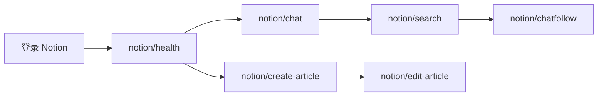

# Notion 使用指南

通过 bun-browser 在浏览器中驱动 **Notion**（`app.notion.com`）：

- **AI 聊天**：侧边栏 Chat / 全屏 `/ai` 页
- **文章页**：`create-article` 新建子页面，`edit-article` 编辑已有页面

## 前置条件

1. 已安装 [bun-browser](https://github.com/epiral/bun-browser)
2. Chrome 扩展已连接，daemon 在运行（`bun-browser status`）
3. 浏览器中已登录 [Notion](https://www.notion.so/)

```bash
bun-browser open https://www.notion.so/ --tab new
```

未登录时，所有命令会**立即**返回：

```json
{
  "error": "Not logged in",
  "hint": "Log into Notion at app.notion.com before using Notion AI commands",
  "action": "bun-browser open https://www.notion.so/"
}
```

## 命令一览

| 命令 | 作用 |
|------|------|
| `bun-browser site notion/health` | 检查登录、侧边栏 Chat、输入框、API 可达性（不发送消息） |
| `bun-browser site notion/models` | 列出可用 AI 模型（Auto、Sonnet、Opus 等） |
| `bun-browser site notion/chat "<prompt>"` | 新建对话并提问 |
| `bun-browser site notion/chatfollow <id> "<prompt>"` | 在已有线程中继续提问 |
| `bun-browser site notion/search "<keyword>"` | 搜索/列出 AI 聊天历史 |
| `bun-browser site notion/create-article "<title>" "<content>"` | 在当前或指定父页面下新建文章页（标题 + 正文） |
| `bun-browser site notion/edit-article "<page-url>" "<content>" --title "<title>"` | 编辑已有页面（更新标题和/或正文；`mode=append` 追加段落） |

## 典型流程



### 新建对话

```bash
bun-browser site notion/chat "Summarize my workspace onboarding checklist"
```

流程：左侧边栏 **Chat** 标签 → **New chat** → 填写输入框 → 发送 → 等待回复。

返回示例：

```json
{
  "query": "Say hello",
  "model": "Auto",
  "modeLabel": "Auto",
  "answer": "Hello there.",
  "conversationId": "37b746ce-978e-8038-a38a-00a992bdb5d5"
}
```

### 继续已有对话

从 `notion/search` 或上次 `chat` 结果获取 `conversationId`：

```bash
bun-browser site notion/chatfollow 37b746ce-978e-8038-a38a-00a992bdb5d5 "Make it shorter"
```

若 Notion 需要跳转到对话页，第一次可能返回 `Navigation required` — 按提示 **重跑同一条命令** 即可。

### 新建文章页

在当前打开的 Notion 页面下创建子页面（或传入 `parent` 指定父页面）：

```bash
bun-browser site notion/create-article "Weekly Recap" "Lead paragraph.\n\nSecond paragraph."
bun-browser site notion/create-article "Notes" "Body text" --parent "https://app.notion.com/p/Bibo-Dashboard-fad773dd10fd83cd81d8017c650ccc93"
```

流程（通常 **3 次**重跑同一条命令）：

1. 在父页面运行 → 返回 `Navigation required`（已打开空白页）
2. **等待约 10 秒** → 重跑 → 写入标题（`partialSuccess`，`nextStep: body`）
3. 重跑 → 写入正文（`created: true`）

`step` 可显式设为 `open`、`title`、`body`。Notion 编辑器在长时间 CDP 轮询期间会拒绝输入，因此每个填写阶段都是一次快速同步脚本。

返回示例：

```json
{
  "title": "Weekly Recap",
  "paragraphCount": 2,
  "bodyCharacterCount": 42,
  "pageId": "37b773dd10fd80d2ba2ac32b34bacfbb",
  "url": "https://app.notion.com/p/37b773dd10fd80d2ba2ac32b34bacfbb",
  "created": true
}
```

若传入 `parent` 且标签页尚未打开该页面，第一次可能返回 `Navigation required` — 按提示 **重跑同一条命令** 即可。

### 编辑已有文章页

在已有 Notion 页面更新标题和/或正文（URL 或 32 位 page id）：

```bash
# 只改正文（保留原标题）
bun-browser site notion/edit-article "37b773dd10fd80288a68c2fda0897975" "Updated lead."$'\n\n'"New second paragraph."

# 同时改标题 + 正文（content 必须写在 --title 等 flag 前面）
bun-browser site notion/edit-article "https://app.notion.com/p/37b773dd10fd80288a68c2fda0897975" "Updated lead."$'\n\n'"New second paragraph." --title "Weekly Recap (Updated)"

# 在末尾追加段落（不改写已有正文）
bun-browser site notion/edit-article "37b773dd10fd80288a68c2fda0897975" "One more paragraph." --mode append
```

**参数顺序（重要）**：bun-browser 按 meta 顺序填充位置参数：`page` → `content`。可选 flag（`--title`、`--mode`、`--step`）请放在 **content 之后**。若把 `--title` 写在 content 前面，content 可能被误当成标题。

流程（通常 **1～2 次**重跑同一条命令）：

1. 标签页未打开目标页 → 返回 `Navigation required` → 重跑
2. 提供了 `--title` 且与当前标题不同 → 返回 `partialSuccess`（`nextStep: body`）→ 重跑写入正文
3. 否则一次完成 → 返回 `edited: true`

`mode=replace`（默认）会把多段正文写入第一个正文块（段间以空行连接）。`mode=append` 在现有正文后追加新段落。

返回示例：

```json
{
  "title": "Weekly Recap (Updated)",
  "content": "Updated lead.\n\nNew second paragraph.",
  "mode": "replace",
  "paragraphCount": 2,
  "pageId": "37b773dd10fd80288a68c2fda0897975",
  "url": "https://app.notion.com/p/Weekly-Recap-Updated-37b773dd10fd80288a68c2fda0897975",
  "edited": true,
  "step": "body"
}
```

标题阶段返回：

```json
{
  "partialSuccess": true,
  "step": "title",
  "nextStep": "body",
  "title": "Weekly Recap (Updated)",
  "hint": "Title updated. Re-run the same command to update the body.",
  "action": "retry same command"
}
```

### 搜索历史

```bash
bun-browser site notion/search "hello"
bun-browser site notion/search
```

优先使用内部 API `getInferenceTranscriptsForUser`；失败时回退到侧边栏 DOM 抓取。

### 选择模型

```bash
bun-browser site notion/models
bun-browser site notion/chat "Explain CRDTs" --model sonnet
```

`--model` 可传 **别名**、**slug id**（如 `sonnet-4-6`）或 **完整 UI 标题**（如 `Sonnet 4.6`）。未知模型会直接按你传入的标题尝试选择。

### 模型列表（`notion/models`）

`notion/models` 会打开 Notion AI 聊天页、点击模型下拉菜单，并抓取菜单中所有 `[role=menuitem]` / `[role=option]` 项。**不再**使用硬编码白名单过滤，因此 Notion 新上的模型也会出现在列表里。

返回示例：

```json
{
  "defaultModelId": "auto",
  "current": "Auto",
  "available": ["auto", "sonnet-4-6", "opus-4-7", "opus-4-8", "fable-5", "gemini-3-1-pro", "gpt-5-2", "gpt-5-4", "gpt-5-5", "grok-4-3", "grok-build-0-1", "kimi-k2-6", "deepseek-v4-pro"],
  "models": [
    { "id": "auto", "title": "Auto", "available": true, "mapped": true },
    { "id": "sonnet-4-6", "title": "Sonnet 4.6", "available": true, "mapped": true },
    { "id": "opus-4-7", "title": "Opus 4.7", "available": true, "mapped": true },
    { "id": "opus-4-8", "title": "Opus 4.8", "available": true, "mapped": true },
    { "id": "fable-5", "title": "Fable 5", "available": true, "mapped": true },
    { "id": "gemini-3-1-pro", "title": "Gemini 3.1 Pro", "available": true, "mapped": true },
    { "id": "gpt-5-2", "title": "GPT-5.2", "available": true, "mapped": true },
    { "id": "gpt-5-4", "title": "GPT-5.4", "available": true, "mapped": true },
    { "id": "gpt-5-5", "title": "GPT-5.5", "available": true, "mapped": true },
    { "id": "grok-4-3", "title": "Grok 4.3", "available": true, "mapped": true },
    { "id": "grok-build-0-1", "title": "Grok Build 0.1", "available": true, "mapped": true },
    { "id": "kimi-k2-6", "title": "Kimi K2.6", "available": true, "mapped": true },
    { "id": "deepseek-v4-pro", "title": "DeepSeek V4 Pro", "available": true, "mapped": true }
  ]
}
```

| 字段 | 说明 |
|------|------|
| `defaultModelId` | 默认模型 slug，固定为 `auto` |
| `current` | 当前选中的 UI 标题 |
| `available` | 所有模型的 slug id 数组 |
| `models[].id` | 由标题派生：`title.toLowerCase().replace(/[^a-z0-9]+/g, '-')` |
| `models[].title` | Notion UI 中的显示名称 |
| `models[].mapped` | `true` = 已在别名表中有对应项；`false` = 新模型，需在 `chat-helpers.js` 的 `MODE_ALIASES` 中补充 |

#### 可用模型一览

下表为 `notion/models` 返回的完整模型列表（slug id 由 UI 标题派生：`title.toLowerCase().replace(/[^a-z0-9]+/g, '-')`）。运行 `bun-browser site notion/models` 可确认你工作区**当前实际可用**的模型（Notion 可能随时间增减）。

| slug id | UI 标题 | `--model` 别名 |
|---------|---------|----------------|
| `auto` | Auto | `auto` |
| `sonnet-4-6` | Sonnet 4.6 | `sonnet`, `sonnet-4.6` |
| `opus-4-7` | Opus 4.7 | `opus`, `opus-4.7` |
| `opus-4-8` | Opus 4.8 | `opus-4.8` |
| `fable-5` | Fable 5 | `fable`, `fable-5` |
| `gemini-3-1-pro` | Gemini 3.1 Pro | `gemini`, `gemini-3.1-pro` |
| `gpt-5-2` | GPT-5.2 | `gpt-5.2` |
| `gpt-5-4` | GPT-5.4 | `gpt-5.4` |
| `gpt-5-5` | GPT-5.5 | `gpt-5.5` |
| `grok-4-3` | Grok 4.3 | `grok`, `grok-4.3` |
| `grok-build-0-1` | Grok Build 0.1 | `grok-build` |
| `kimi-k2-6` | Kimi K2.6 | `kimi`, `kimi-k2.6` |
| `deepseek-v4-pro` | DeepSeek V4 Pro | `deepseek`, `deepseek-v4-pro` |

别名定义见 `chat-helpers.js` 的 `MODE_ALIASES`。`mapped: false` 的模型（Notion 新上、别名表尚未更新）仍可通过 **slug id** 或 **完整 UI 标题** 传给 `--model`。

#### 列表可能不完整的情况

| 情况 | 结果 |
|------|------|
| 聊天页未加载 / 找不到模型选择器 | 仅返回 `Auto`，并带 `warning: Model picker not reachable...` |
| 菜单中的 UI 控件文案（如 `New chat`、`Submit`） | 被 `isLikelyModelMenuTitle()` 过滤 |
| 标题超过 80 字符 | 跳过 |
| 需要滚动才出现的菜单项 | 若 Notion 懒加载，可能漏抓 |

`mapped: false` 的模型**仍会列出**；只是 `--model` 短别名尚不可用，需传完整 `title` 或 slug `id`。

#### 仅测试模型选择（不发送消息）

```bash
bun-browser site notion/chat --model sonnet --selectOnly true
```

返回 `{ "selected": true, "modeLabel": "Sonnet 4.6", ... }`，不消耗 AI 额度发送提示词。E2E 流程 `run-api-flow.mjs` 对每个模型都走此路径做选择矩阵测试。

## 多标签页与长时间生成

Notion Agent 任务（搜索、多步推理）可能运行 **数分钟到 15 分钟**。每个进行中的提示词应**绑定一个浏览器标签页**：在该 tab 上只轮询，不要点 New chat 或重新导航。

### 原则

| Tab 状态 | 正确做法 |
|----------|----------|
| 仍在生成 | 留在原 tab，用 **waitOnly** 轮询 |
| 新提示词 | 开 **新 tab**（`--tab new`），在新 tab 上 `notion/chat` |
| 误在新 prompt 上跑默认 `newChat` | 若 tab 仍在生成 → 返回 **`Tab busy`**，不会打断进行中的回复 |

```bash
# 查看标签页
bun-browser tab list --json

# 新任务：新 tab
bun-browser open https://app.notion.com/ai --tab new
bun-browser site notion/chat "$(cat prompt.txt)" --model kimi --tab <TAB_ID> --json

# 进行中的任务：只轮询，不 resubmit
bun-browser site notion/chat "x" auto true false true --tab <TAB_ID> --json
```

**不要**在仍生成中的 tab 上执行 `open .../ai --tab <ID>` 或带 `newChat: true` 的 chat — 会中断 Agent。

### 位置参数顺序（`notion/chat`）

bun-browser 按 meta 顺序传位置参数。`waitOnly`、`newChat` 等 **CLI `--flag` 可能被全局解析器丢弃**，请用位置参数：

```
query → model → newChat → selectOnly → waitOnly → (空) → maxWaitMs
```

| 索引 | 参数 | 典型值 |
|------|------|--------|
| 0 | `query` | 提示词，或 waitOnly 时 `"x"` |
| 1 | `model` | `auto`、`kimi`、`grok` 等 |
| 2 | `newChat` | `true` / `false` |
| 3 | `selectOnly` | `false` |
| 4 | `waitOnly` | `true` 表示只轮询 |
| 5 | （保留） | 传空或省略 |
| 6 | `maxWaitMs` | 毫秒；也可用 `--maxWaitMs` |

示例：

```bash
# 提交新对话（位置参数 newChat=true，waitOnly=false）
bun-browser site notion/chat "Hello" auto true false false --tab f547 --json

# 轮询进行中的回复（waitOnly=true）
bun-browser site notion/chat "x" auto true false true --tab f547 --json

# 快速探测是否还在生成（约 5 秒）
bun-browser site notion/chat "x" auto true false true --maxWaitMs 5000 --tab f547 --json
```

`--model`、`--tab`、`--json` 等 bun-browser 全局选项仍可照常使用。

### 判断回复是否完成

**方式 1 — waitOnly 轮询（推荐）**

| 返回 | 含义 |
|------|------|
| `{ "answer": "...", "waitOnly": true }` | 已完成 |
| `{ "error": "Still generating" }` | 仍在生成，重跑同一条 waitOnly 命令 |
| `{ "error": "Tab busy" }` | 误用了 `newChat` 而非 waitOnly；改用位置参数 `... true false true` |

**方式 2 — 即时 DOM 快照（不等待）**

```bash
bun-browser eval "(function(){var h=globalThis.__notionAiChatHelpers;if(!h)return{error:'helpers not loaded'};var msgs=h.getAssistantMessages();var ans=msgs.length?h.getAssistantText(msgs[msgs.length-1]):'';return{generating:h.isGenerating(),inProgress:h.isChatInProgress(),answerLen:ans.length,preview:ans.slice(0,300),looksFinal:h.looksLikeFinalAnswer(ans),conversationId:h.getConversationId()};})()" --tab <TAB_ID> --json
```

- `generating: true` 或 `inProgress: true` → 仍在工作（Thinking、Searching、Computing 等）
- `looksFinal: true` 且 `inProgress: false` → 大概率已完成，可用 waitOnly 收取最终文本

`notion/health` **不**检测某条回复是否仍在生成。

### 并行多任务

每个并行 prompt 各占一个 tab（参见 `notion/example/test-models-test2.mjs`）：

```bash
bun-browser tab new https://app.notion.com/ai
bun-browser tab new https://app.notion.com/ai
# 分别对 tab A / tab B 提交，超时后用位置参数 waitOnly 轮询各自 tab
```

## 参数

### notion/chat

| 参数 | 默认 | 说明 |
|------|------|------|
| `query` | 必填（`selectOnly` 时可选） | 发送给 Notion AI 的提示词 |
| `model` | `auto` | 模型名称或别名 |
| `newChat` | `true` | 是否先点 New chat |
| `selectOnly` | `false` | 只选择模型，不发送提示词 |
| `waitOnly` | `false` | 只轮询进行中的回复，不重新发送（**请用位置参数**，见上文） |
| `allowBusyTab` | `false` | 允许在仍生成的 tab 上执行 `newChat`（默认拒绝并返回 `Tab busy`） |
| `maxWaitMs` | 15 分钟 | 最长等待时间 |
| `graceWaitMs` | — | 额外等待毫秒数 |

### notion/create-article

| 参数 | 默认 | 说明 |
|------|------|------|
| `title` | 必填 | 页面标题 |
| `content` | 必填 | 正文（纯文本；段落以空行分隔） |
| `parent` | 当前打开页 | 父页面 URL 或 32 位 page id |
| `step` | `auto` | `auto`：按当前页面自动选择 `open` / `title` / `body`；也可显式指定某一阶段 |

### notion/edit-article

| 参数 | 默认 | 说明 |
|------|------|------|
| `page` | 必填 | 要编辑的页面 URL 或 32 位 page id |
| `content` | 必填 | 正文（纯文本；段落以空行分隔） |
| `title` | 保持原标题 | 新标题（省略则不修改） |
| `mode` | `replace` | `replace`：替换正文；`append`：在末尾追加段落 |
| `step` | `auto` | `auto`：未打开目标页则 `navigate`，标题待改则 `title`，否则 `body`；也可显式指定某一阶段 |

### notion/chatfollow

| 参数 | 默认 | 说明 |
|------|------|------|
| `conversation` | 必填 | 线程 UUID 或 `https://app.notion.com/chat?t=...` URL |
| `query` | 必填 | 跟进提示词 |
| `model` | `auto` | 模型 |
| `waitOnly` | `false` | 只轮询（**请用位置参数** `... true false true`，见「多标签页与长时间生成」） |

## 错误与处理

| 场景 | `error` | 建议 `action` |
|------|---------|---------------|
| 未登录 | `Not logged in` | `bun-browser open https://www.notion.so/` |
| 找不到 AI 侧边栏 | `AI chat sidebar not found` | 打开工作区并确认 AI 已启用 |
| 找不到 New chat | `New chat button not found` | `bun-browser site notion/health` |
| 需要页面跳转 | `Navigation required` | 重跑同一条命令 |
| 标题已写入、正文待填 | `partialSuccess` + `nextStep: body` | 重跑同一条命令 |
| 无法设置标题/正文 | `Could not set page title` / `Could not set body text` | 等待页面加载完成后重跑 |
| 找不到正文区 | `Body editor not found` | 确认页面已打开且为普通文章页，然后重跑 |
| 仍在生成 | `Still generating` | 用位置参数 waitOnly 重试：`notion/chat "x" auto true false true --tab <ID>` |
| Tab 仍在生成、误开新对话 | `Tab busy`（`kind: chat_in_progress`） | `bun-browser open https://app.notion.com/ai --tab new`，在新 tab 提交；原 tab 用 waitOnly 轮询 |
| 无回复 | `Empty response` | 刷新 Notion 标签页；确认 Chrome 中该 tab **处于前台可见**（见下方「回复已完成但未捕获」） |
| 回复已完成但未捕获 | `Empty response` / `Still generating`，或成功但带 `captureWarning` | 见下方专节 |
| 免费 AI 次数用尽 | `Run out of free AI responses` | 等待或升级计划 |
| AI 额度用尽 | `AI credits exhausted` | 等待或升级计划 |
| 模型选择失败 | `Mode selection failed` | `bun-browser site notion/models` 核对标题 |
| 模型列表异常 | `warning` 含 picker not reachable | 先打开 `/ai` 聊天页再重试 |

### 回复已完成但未捕获

若你在 Chrome 里已看到 Copy/Save 工具栏和完整回复，但 `notion/chat` 返回 `Empty response` 或 `Still generating`：

1. **Tab 必须可见**：`bun-browser` 新开 tab 默认在后台（`document.hidden === true`），Chrome 会节流页面定时器，Notion 也可能延迟渲染。执行前检查：
   ```bash
   bun-browser eval "({hidden:document.hidden,visibility:document.visibilityState})" --tab <TAB_ID> --json
   ```
   需要 `"hidden": false`。请把 Chrome 切到前台并选中该 Notion tab。
2. **waitOnly 重试**：`notion/chat "x" auto true false true --tab <ID>`
3. **v32 恢复路径**：helpers 在 wait 结束时会用 `recoverCompletedAnswer` 再扫一遍 DOM；若 tab 隐藏，响应可能带 `captureWarning` 提示聚焦 tab。

## 开发同步

```bash
cp -r notion ~/.bun-browser/claw-bun-mcp/
# 或
bun-browser site update

bun test notion/test-chat-helpers.test.mjs
bun notion/scripts/run-api-flow.mjs
```

修改 `chat-helpers.js` 后需重新生成内联文件：

```bash
bun notion/scripts/inline-helpers.mjs
```

## 实现说明

### AI 聊天

- **登录检测**：`notion_user_id` + `notion_users` cookie（在任何 DOM/API 操作之前检查）
- **侧边栏入口**：`[role=tab][aria-label="Chat"]`，或全屏聊天布局 `/ai`、`/chat`
- **New chat**：`[aria-label="New chat"]`
- **输入框**：`[contenteditable=true][role=textbox]`（`/ai` 落地页需 `beforeinput` 注入）
- **发送**：`[aria-label="Submit AI message"]` 或 Enter
- **会话 ID**：URL 参数 `t`（如 `https://app.notion.com/chat?t=...&wfv=chat`）
- **历史 API**：`POST /api/v3/getInferenceTranscriptsForUser`
- **模型列表**：DOM 抓取下拉菜单（`listNotionModelsFromUi`），非 Notion API
- **模型选择器定位**：聊天输入框附近的 `aria-haspopup="menu"` 按钮，或 Submit 按钮同区域的可见按钮
- **回复完整性**：轮询 DOM 直至最新 assistant 回复上出现 4 个 reply action 按钮（`Copy response`、`Save to private pages`、`Share positive feedback`、`Share negative feedback`，各带 `svg` 子元素），且 `looksLikeFinalAnswer` 通过、文本稳定；不依赖 `"Notion AI finished"` 文案；进度行（`Thinking`、`Searching` 等）会被过滤；短 intro stub（如 `I'll prioritize…`）由 `looksLikeInProgressAnswer` 视为未完成；调试 eval 可用 `hasCompletedReplyActions()`
- **完成检测（v33）**：`hasCompletedReplyActionsForTurn(beforeCount, beforeText)` — 工具栏 + 本轮新内容；`getAssistantAnswerSince` 支持同一条 assistant 消息原地更新（`messages.length === beforeCount`）；wait 结束前 `recoverCompletedAnswer` 兜底
- **异常检测**：`detectNotionPageAbnormal` 识别 `credits_exhausted`（含 `Run out of free AI responses`）、`rate_limit`、`submit_disabled`

### 文章页（create-article / edit-article）

- **标题编辑器**：`h1[contenteditable=true][role=textbox]`
- **正文编辑器**：`[data-content-editable-leaf=true]`、`[contenteditable=true][placeholder]` 等 leaf 节点
- **空白页创建**：点击 `[aria-label="New page"]` → 菜单选 **Page** → 等待导航完成后再填写
- **写入方式**：空白页标题/正文优先 `document.execCommand('insertText')`；**已有页面**的标题与正文需 `beforeinput` + `insertReplacementText`（否则 DOM 改动不会持久化）
- **同步写入**：每个填写阶段必须是一次短同步 eval（脚本内不能 `await sleep` 等待）；`create-article` 在 `open` 与 `title` 之间需在外部等待约 10 秒
- **分步执行**：`step=auto` 每次 invocation 只做一个阶段（`open` / `title` / `body` 或 `navigate` / `title` / `body`），通过重跑同一条命令推进
