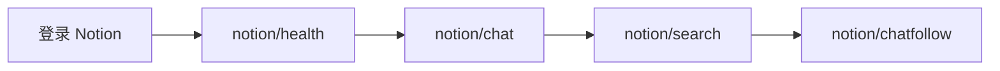

# Notion AI 使用指南

通过 bun-browser 在浏览器中驱动 **Notion 侧边栏 AI 聊天**（`app.notion.com`）。

## 前置条件

1. 已安装 [bun-browser](https://github.com/epiral/bun-browser)
2. Chrome 扩展已连接，daemon 在运行（`bun-browser status`）
3. 浏览器中已登录 [Notion](https://www.notion.so/)

```bash
bun-browser open https://www.notion.so/ --tab new
```

未登录时，所有命令会**立即**返回：

```json
{
  "error": "Not logged in",
  "hint": "Log into Notion at app.notion.com before using Notion AI commands",
  "action": "bun-browser open https://www.notion.so/"
}
```

## 命令一览

| 命令 | 作用 |
|------|------|
| `bun-browser site notion/health` | 检查登录、侧边栏 Chat、输入框、API 可达性（不发送消息） |
| `bun-browser site notion/models` | 列出可用 AI 模型（Auto、Sonnet、Opus 等） |
| `bun-browser site notion/chat "<prompt>"` | 新建对话并提问 |
| `bun-browser site notion/chatfollow <id> "<prompt>"` | 在已有线程中继续提问 |
| `bun-browser site notion/search "<keyword>"` | 搜索/列出 AI 聊天历史 |

## 典型流程



### 新建对话

```bash
bun-browser site notion/chat "Summarize my workspace onboarding checklist"
```

流程：左侧边栏 **Chat** 标签 → **New chat** → 填写输入框 → 发送 → 等待回复。

返回示例：

```json
{
  "query": "Say hello",
  "model": "Auto",
  "modeLabel": "Auto",
  "answer": "Hello there.",
  "conversationId": "37b746ce-978e-8038-a38a-00a992bdb5d5"
}
```

### 继续已有对话

从 `notion/search` 或上次 `chat` 结果获取 `conversationId`：

```bash
bun-browser site notion/chatfollow 37b746ce-978e-8038-a38a-00a992bdb5d5 "Make it shorter"
```

若 Notion 需要跳转到对话页，第一次可能返回 `Navigation required` — 按提示 **重跑同一条命令** 即可。

### 搜索历史

```bash
bun-browser site notion/search "hello"
bun-browser site notion/search
```

优先使用内部 API `getInferenceTranscriptsForUser`；失败时回退到侧边栏 DOM 抓取。

### 选择模型

```bash
bun-browser site notion/models
bun-browser site notion/chat "Explain CRDTs" --model sonnet
```

`--model` 可传 **别名**、**slug id**（如 `sonnet-4-6`）或 **完整 UI 标题**（如 `Sonnet 4.6`）。未知模型会直接按你传入的标题尝试选择。

### 模型列表（`notion/models`）

`notion/models` 会打开 Notion AI 聊天页、点击模型下拉菜单，并抓取菜单中所有 `[role=menuitem]` / `[role=option]` 项。**不再**使用硬编码白名单过滤，因此 Notion 新上的模型也会出现在列表里。

返回示例：

```json
{
  "defaultModelId": "auto",
  "current": "Auto",
  "available": ["auto", "sonnet-4-6", "opus-4-7", "opus-4-8", "fable-5", "gemini-3-1-pro", "gpt-5-2", "gpt-5-4", "gpt-5-5", "grok-4-3", "grok-build-0-1", "kimi-k2-6", "deepseek-v4-pro"],
  "models": [
    { "id": "auto", "title": "Auto", "available": true, "mapped": true },
    { "id": "sonnet-4-6", "title": "Sonnet 4.6", "available": true, "mapped": true },
    { "id": "opus-4-7", "title": "Opus 4.7", "available": true, "mapped": true }
  ]
}
```

| 字段 | 说明 |
|------|------|
| `defaultModelId` | 默认模型 slug，固定为 `auto` |
| `current` | 当前选中的 UI 标题 |
| `available` | 所有模型的 slug id 数组 |
| `models[].id` | 由标题派生：`title.toLowerCase().replace(/[^a-z0-9]+/g, '-')` |
| `models[].title` | Notion UI 中的显示名称 |
| `models[].mapped` | `true` = 已在别名表中有对应项；`false` = 新模型，需在 `chat-helpers.js` 的 `MODE_ALIASES` 中补充 |

#### 已知别名（`MODE_ALIASES`）

以下为当前内置别名。运行 `notion/models` 可获取你工作区**实际可用**的完整列表（可能与下表不同）。

| 别名 / slug | UI 标题 |
|-------------|---------|
| `auto` | Auto |
| `sonnet`, `sonnet-4.6` | Sonnet 4.6 |
| `opus`, `opus-4.7` | Opus 4.7 |
| `opus-4.8` | Opus 4.8 |
| `fable`, `fable-5` | Fable 5 |
| `gemini`, `gemini-3.1-pro` | Gemini 3.1 Pro |
| `gpt-5.2` | GPT-5.2 |
| `gpt-5.4` | GPT-5.4 |
| `gpt-5.5` | GPT-5.5 |
| `grok`, `grok-4.3` | Grok 4.3 |
| `grok-build` | Grok Build 0.1 |
| `kimi`, `kimi-k2.6` | Kimi K2.6 |
| `deepseek`, `deepseek-v4-pro` | DeepSeek V4 Pro |

#### 列表可能不完整的情况

| 情况 | 结果 |
|------|------|
| 聊天页未加载 / 找不到模型选择器 | 仅返回 `Auto`，并带 `warning: Model picker not reachable...` |
| 菜单中的 UI 控件文案（如 `New chat`、`Submit`） | 被 `isLikelyModelMenuTitle()` 过滤 |
| 标题超过 80 字符 | 跳过 |
| 需要滚动才出现的菜单项 | 若 Notion 懒加载，可能漏抓 |

`mapped: false` 的模型**仍会列出**；只是 `--model` 短别名尚不可用，需传完整 `title` 或 slug `id`。

#### 仅测试模型选择（不发送消息）

```bash
bun-browser site notion/chat --model sonnet --selectOnly true
```

返回 `{ "selected": true, "modeLabel": "Sonnet 4.6", ... }`，不消耗 AI 额度发送提示词。E2E 流程 `run-api-flow.mjs` 对每个模型都走此路径做选择矩阵测试。

## 参数

### notion/chat

| 参数 | 默认 | 说明 |
|------|------|------|
| `query` | 必填（`selectOnly` 时可选） | 发送给 Notion AI 的提示词 |
| `model` | `auto` | 模型名称或别名 |
| `newChat` | `true` | 是否先点 New chat |
| `selectOnly` | `false` | 只选择模型，不发送提示词 |
| `waitOnly` | `false` | 只轮询进行中的回复，不重新发送 |
| `maxWaitMs` | 15 分钟 | 最长等待时间 |
| `graceWaitMs` | — | 额外等待毫秒数 |

### notion/chatfollow

| 参数 | 默认 | 说明 |
|------|------|------|
| `conversation` | 必填 | 线程 UUID 或 `https://app.notion.com/chat?t=...` URL |
| `query` | 必填 | 跟进提示词 |
| `model` | `auto` | 模型 |
| `waitOnly` | `false` | 只轮询 |

## 错误与处理

| 场景 | `error` | 建议 `action` |
|------|---------|---------------|
| 未登录 | `Not logged in` | `bun-browser open https://www.notion.so/` |
| 找不到 AI 侧边栏 | `AI chat sidebar not found` | 打开工作区并确认 AI 已启用 |
| 找不到 New chat | `New chat button not found` | `bun-browser site notion/health` |
| 需要页面跳转 | `Navigation required` | 重跑同一条命令 |
| 仍在生成 | `Still generating` | 加 `--waitOnly true` 重试 |
| 无回复 | `Empty response` | 刷新 Notion 标签页 |
| AI 额度用尽 | `AI credits exhausted` | 等待或升级计划 |
| 模型选择失败 | `Mode selection failed` | `bun-browser site notion/models` 核对标题 |
| 模型列表异常 | `warning` 含 picker not reachable | 先打开 `/ai` 聊天页再重试 |

## 开发同步

```bash
cp -r notion ~/.bun-browser/claw-bun-mcp/
# 或
bun-browser site update

bun test notion/test-chat-helpers.test.mjs
bun notion/scripts/run-api-flow.mjs
```

修改 `chat-helpers.js` 后需重新生成内联文件：

```bash
bun notion/scripts/inline-helpers.mjs
```

## 实现说明

- **登录检测**：`notion_user_id` + `notion_users` cookie（在任何 DOM/API 操作之前检查）
- **侧边栏入口**：`[role=tab][aria-label="Chat"]`，或全屏聊天布局 `/ai`、`/chat`
- **New chat**：`[aria-label="New chat"]`
- **输入框**：`[contenteditable=true][role=textbox]`（`/ai` 落地页需 `beforeinput` 注入）
- **发送**：`[aria-label="Submit AI message"]` 或 Enter
- **会话 ID**：URL 参数 `t`（如 `https://app.notion.com/chat?t=...&wfv=chat`）
- **历史 API**：`POST /api/v3/getInferenceTranscriptsForUser`
- **模型列表**：DOM 抓取下拉菜单（`listNotionModelsFromUi`），非 Notion API
- **模型选择器定位**：聊天输入框附近的 `aria-haspopup="menu"` 按钮，或 Submit 按钮同区域的可见按钮
- **回复完整性**：轮询 DOM 直至 `looksLikeFinalAnswer` 通过且文本稳定；进度行（`Thinking`、`Searching`、`Notion AI finished` 等）会被过滤
- **异常检测**：`detectNotionPageAbnormal` 识别 `credits_exhausted`、`rate_limit`、`submit_disabled`
